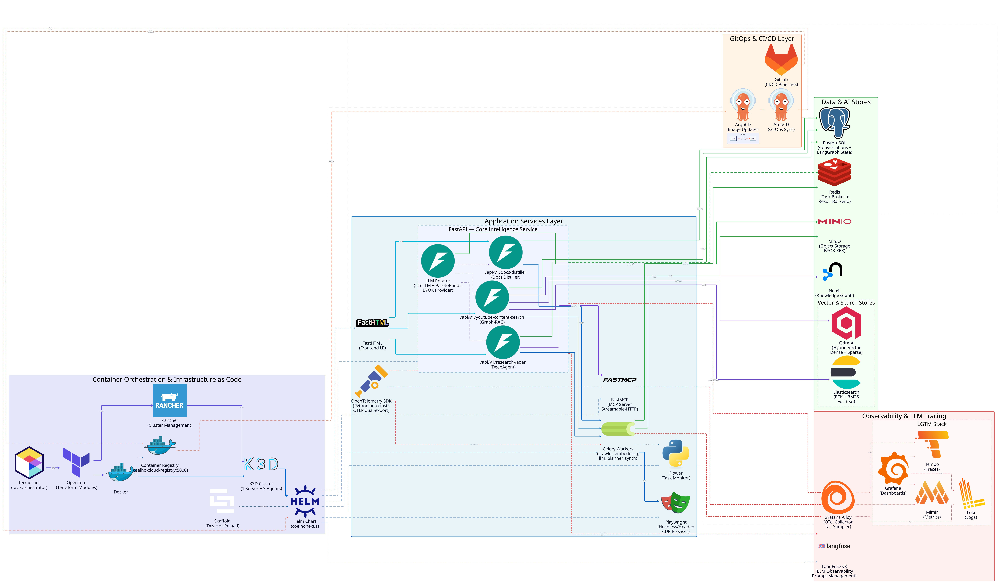

<p align="center"></p>

<p align="center"><strong>A Kubernetes-native, multi-service AI agent platform — built solo, production-ready.</strong></p>

<p align="center">
  <a href="https://www.python.org/"></a>
  <a href="https://fastapi.tiangolo.com/"></a>
  <a href="https://kubernetes.io/"></a>
  <a href="https://www.terraform.io/"></a>
  <a href="https://argoproj.github.io/cd/"></a>
  <a href="https://grafana.com/"></a>
  
</p>

---

## Table of Contents

- [What is this?](#what-is-this)
- [The three applications](#the-three-applications)
- [Architecture](#architecture)
- [Tech Stack](#tech-stack)
- [Key Components](#key-components)
- [Prerequisites](#prerequisites)
- [Infrastructure Specifications](#infrastructure-specifications)
- [Installation](#installation)
- [Service Access](#service-access)
- [Monitoring & Observability](#monitoring--observability)
- [CI/CD & Deployment Model](#cicd--deployment-model)
- [Project Structure](#project-structure)
- [Author](#author)

---

## What is this?

COELHO Nexus is a single, self-contained platform hosting three independent AI-powered applications, all running on the same Kubernetes cluster, sharing the same observability stack, the same free-tier LLM rotator, and the same infrastructure-as-code foundation. It was designed and built end-to-end by one engineer — from the Terraform modules that provision every data store, to the FastAPI/FastHTML/FastMCP services that run the apps, to the pipeline that deploys them.

The point of this repo isn't just "three AI apps." It's a demonstration of what a single engineer can own end-to-end: infrastructure, backend, observability, and delivery, all treated with the same rigor a platform team would bring to production.

## The three applications

| Feature | What it does |
|---|---|
| **Docs Distiller** | Turns any framework's scattered documentation into a single, coherent study guide. A five-tier ingestion cascade (`llms_full.txt` → `llms_txt` → sitemap → httpx-crawl-with-Playwright-fallback → GitHub README) pulls in raw docs; a Planner → Resolver → Synth pipeline turns them into a structured, chapter-by-chapter book. |
| **YouTube Content Search** | Full semantic search over YouTube video transcripts. Playwright-driven transcript scraping feeds a hybrid retrieval pipeline — Qdrant for dense vector search, Elasticsearch for full-text, Neo4j for the entity/relationship graph extracted from what's actually said in each video. |
| **Research Radar** | An autonomous research-digest agent. An 8-phase DeepAgents orchestrator pulls from four discovery sources (arXiv, Semantic Scholar, HuggingFace daily papers, Hacker News), scores every candidate with an 8-term weighted relevance signal, and ships a ranked, implementable-ideas digest — no manual paper-hunting required. |

## Architecture

<div align="center">

</div>

**Three microservices, one platform:**
- **FastAPI** — the ML/agent backend. Owns the actual pipelines for all three features, plus Celery-orchestrated background task queues (one isolated queue per feature pipeline).
- **FastHTML** — the frontend. Server-side rendered, HTMX-reactive, no separate JS build step. Streams live pipeline progress over SSE.
- **FastMCP** — an internal Model Context Protocol tool surface. Exposes discovery/retrieval tools that the agent pipelines call into, with BYOK credential injection and rate-limited token buckets.

**Data layer**, six stores, each earning its place rather than being there by default:
- **PostgreSQL** — relational state (Grafana, LangFuse, ArgoCD).
- **Neo4j** — knowledge graphs (YCS entity/relationship extraction, Research Radar's author-paper network).
- **Qdrant** — vector search (YCS transcript embeddings, Research Radar paper deduplication and relevance scoring).
- **Elasticsearch** — full-text search over ingested transcripts and documents.
- **MinIO** — S3-compatible object storage; also backs Loki/Tempo/Mimir's own storage.
- **Redis** — caching and Celery's broker/result backend.

**Infrastructure as code**: 18 Terraform modules, deployed declaratively via Terragrunt onto a local k3d cluster. Every data store, every observability component, and the platform layer itself are provisioned this way — nothing is clicked together by hand.

**Observability**: full OpenTelemetry instrumentation dual-exported to both a Grafana LGTM stack (Loki for logs, Grafana Mimir for metrics, Tempo for traces, Alloy as the collector) and LangFuse for LLM-specific tracing — every pipeline run, every LLM call, every token, traced and queryable.

**LLM access**: 100% free-tier. A custom rotator load-balances across 20+ free models from multiple providers using bandit-based routing (favoring models that are actually performing well, not just round-robin), with BYOK (Bring Your Own Key) encrypted credential management so you can swap in your own provider keys.

## Tech Stack

### Backend & AI/ML

| Technology | Purpose |
|---|---|
| **FastAPI** | ML/agent backend — owns all three pipelines |
| **FastHTML** | Server-rendered, HTMX-reactive frontend |
| **FastMCP** | Internal Model Context Protocol tool gateway |
| **Celery** | Background task orchestration, one queue per feature |
| **DeepAgents** | Multi-phase autonomous agent orchestration (Research Radar) |
| **LangGraph** | Graph-structured pipelines (Docs Distiller Planner/Synth) |
| **Playwright** | Headless/headed browser automation — transcript scraping, doc-site rendering |

### Infrastructure & DevOps

| Technology | Purpose |
|---|---|
| **Terraform / Terragrunt** | Infrastructure-as-Code — 18 modules, DRY multi-environment composition |
| **k3d** | Local Kubernetes cluster (k3s in Docker) |
| **Kubernetes** | Container orchestration |
| **Helm** | Kubernetes package management |
| **ArgoCD** | GitOps continuous delivery (production cluster) |
| **Skaffold** | Cross-platform local build/deploy workflow (standalone cluster) |

### Data & Storage

| Technology | Purpose |
|---|---|
| **PostgreSQL** | Relational state for Grafana, LangFuse, ArgoCD |
| **Neo4j** | Knowledge graphs — entity/relationship extraction |
| **Qdrant** | Vector search — dense embeddings, dedup, relevance scoring |
| **Elasticsearch** | Full-text search over transcripts and documents |
| **MinIO** | S3-compatible object storage |
| **Redis** | Caching, Celery broker/result backend |

### Observability

| Technology | Purpose |
|---|---|
| **OpenTelemetry** | Vendor-neutral traces/metrics/logs instrumentation |
| **Grafana** | Dashboards across the full LGTM stack |
| **Mimir** | Metrics (Prometheus-compatible, long-term storage) |
| **Loki** | Logs |
| **Tempo** | Distributed traces |
| **Alloy** | OTLP collector, routes to Mimir/Loki/Tempo |
| **LangFuse** | LLM-specific tracing — prompts, tokens, cost, sessions |

## Key Components

<div align="center">

</div>

<p align="center"><em>Every LangGraph node, FastMCP tool, and data-store write in the three pipelines below, plus the shared LLM Rotator they all route through.</em></p>

### The free-tier LLM rotator

Every LLM call across all three features routes through a single rotator that load-balances across 20+ free models from multiple providers (NVIDIA NIM, Groq, Cerebras, Mistral, Google, DeepSeek, SambaNova) using bandit-based arm selection — models that are actually performing well get more traffic, not round-robin. BYOK: bring your own provider keys via the `/settings` UI, encrypted at rest in MinIO.

### Docs Distiller's five-tier ingestion cascade

Any framework's documentation gets pulled in through the cheapest source that actually works: a pre-bundled `llms_full.txt`, then a `llms_txt` link index, then `sitemap.xml`, then an `httpx` crawl with Playwright fallback for JS-rendered sites, then a GitHub README as last resort. A Planner → Resolver → Synth pipeline turns whatever lands into a structured, chapter-by-chapter study guide.

### Research Radar's DeepAgents orchestrator

An 8-phase autonomous agent pulls candidates from four discovery sources (arXiv, Semantic Scholar, HuggingFace daily papers, Hacker News) via FastMCP tools, scores each one on an 8-term weighted relevance signal, and synthesizes a ranked digest — no manual paper-hunting required.

### YCS hybrid retrieval

YouTube transcript search blends three retrieval signals at once: Qdrant dense vectors for semantic similarity, Elasticsearch for full-text/keyword matching, and a Neo4j entity graph extracted from what's actually said in each video — so a search can be answered by meaning, exact phrase, or relationship, whichever fits the query.

## Prerequisites

| Tool | Minimum Version | Purpose |
|---|---|---|
| **Docker** | 20.10+ | Container runtime |
| **k3d** | 5.0+ | Local Kubernetes cluster |
| **kubectl** | 1.28+ | Kubernetes CLI |
| **Terraform** or **OpenTofu** | 1.6+ | Infrastructure provisioning engine — install via [`tenv`](https://github.com/tofuutils/tenv) (version manager for Terraform/OpenTofu/Terragrunt) |
| **Terragrunt** | 0.55+ | DRY multi-module orchestration — also installable via `tenv` |
| **Helm** | 3.12+ | Chart management (invoked by Terraform) |
| **Skaffold** | latest | Build + deploy workflow for the app layer |
| **Python** | 3.13+ | Running `upload_env_to_k3d.py`; app runtime inside containers |
| **Git** | latest | Version control |

## Infrastructure Specifications

> Numbers below are the sum of every module's configured Kubernetes resource **requests** and **limits** (from each module's `variables.tf` defaults) — not live-measured peak usage. Treat the request total as a realistic floor and the limit total as a ceiling only reached under sustained load across every service at once.

| Component | Memory Request | Memory Limit | Notes |
|---|---|---|---|
| **Playwright** (server + headed + headless) | 1.7Gi | 7.2Gi | Real Chromium instances — the single biggest consumer |
| **Mimir** (9 microservices) | 1.8Gi | 4.1Gi | Ingester, distributor, querier, compactor, ruler, gateway, etc. |
| **Langfuse** (web + worker + ClickHouse) | 2Gi | 3Gi | LLM tracing backend |
| **Neo4j** | 2Gi | 2Gi | Fixed heap sizing |
| **Elasticsearch** (+ Kibana) | 1.4Gi | 2.1Gi | |
| **ArgoCD** (server + controller + repo-server + image-updater) | 0.8Gi | 1.6Gi | |
| **Rancher** | 512Mi | 1.5Gi | Optional — cluster management UI |
| **Tempo** | 256Mi | 1Gi | |
| **Redis** | 96Mi | 448Mi | |
| **PostgreSQL** | 200Mi | 384Mi | |
| **MinIO** | 200Mi | 384Mi | |
| **Qdrant** | 200Mi | 512Mi | |
| **Grafana / Loki / Alloy** (~256Mi req / ~512Mi lim each) | 768Mi | 1.5Gi | |
| **Total (approximate)** | **~12Gi** | **~26Gi** | Plus `cert-manager`, `k3d`, and CRD-only modules — negligible footprint |

### Minimum hardware

| Tier | RAM | CPU Cores | Notes |
|---|---|---|---|
| **Minimum** | 16GB | 6 | Fine for running one feature pipeline at a time; expect tighter headroom under concurrent load |
| **Recommended** | 32GB | 8+ | Comfortable headroom for the full stack plus Docker + host OS overhead (~4-6GB) |

## Installation

> Step-by-step install instructions are being written and verified against a real from-scratch install as this section is filled in. Steps below are confirmed; more are added only after being verified against a live run. Check back shortly, or watch this repo for updates.

### 1. Clone the repository

```bash
git clone https://github.com/rafaelcoelho1409/COELHONexus.git
cd COELHONexus
```

### 2. Provision the infrastructure

Confirmed working against a real from-scratch install (fresh `k3d cluster delete` + wiped state → clean `apply`):

```bash
cd infrastructure/live/coelhonexus
terragrunt run --all apply --non-interactive --parallelism 1
```

This is the only command needed — Terragrunt walks the dependency graph across all 6 layers (bootstrap → platform → data → observability → apps → edge) and applies every module in the correct order automatically. Takes roughly 25-30 minutes.

`--parallelism 1` forces modules with no dependency on each other to still apply one at a time, rather than all at once — safe default for any machine, since unlimited parallelism means up to 6 concurrent Helm installs in the data layer alone, which can OOM a resource-constrained machine or trigger image-pull timeouts.

**On a more powerful machine**, drop the flag entirely once you've confirmed your hardware has headroom (see [Infrastructure Specifications](#infrastructure-specifications)) — concurrent siblings finish considerably faster:

```bash
terragrunt run --all apply --non-interactive
```

Full flag rationale, dry-run instructions, and a phased-script alternative are in [`infrastructure/README.md`](infrastructure/README.md).

### 3. Upload credentials

Before deploying the app, the pods need real environment variables as a Kubernetes Secret — uploaded with [`upload_env_to_k3d.py`](upload_env_to_k3d.py), cross-platform, no shell script involved.

**Recommended** — copy `.env.example` to a real, personal `.env` and fill in at least one LLM provider key before uploading either one:

```bash
cp .env.example .env
# edit .env — set one of NVIDIA_API_KEY / GROQ_API_KEY / CEREBRAS_API_KEY / etc.
```

**The secret is namespace-scoped, and the two deploy paths (step 4 below) use different namespaces — each needs its own copy.** Upload to whichever one(s) match the path you're actually using:

| Deploy path | Namespace | Command |
|---|---|---|
| ArgoCD | `coelhonexus` | `python upload_env_to_k3d.py .env coelhonexus` |
| `skaffold dev` | `coelhonexus-dev` | `python upload_env_to_k3d.py .env coelhonexus-dev` |

`.env.example`'s placeholder infrastructure credentials (`postgres`, `redis-demo-password`, etc.) are fine as-is — they already match what Terragrunt provisioned via `env.hcl`. Only the LLM keys are worth replacing — without at least one, DD/YCS/RR won't do anything real.

**Quick test** — skip the copy/edit step and pass `.env.example` directly as the source file for either command above (e.g. `python upload_env_to_k3d.py .env.example coelhonexus`). Works, but every BYOK provider key in it is blank.

### 4. Deploy the application

Two independent deploy paths — pick one. Neither has been fully verified end-to-end on a fresh install yet.

#### Option A — ArgoCD

Build and push images to the registry first; ArgoCD's Image Updater (not you) detects the new image and triggers the deploy. Two interchangeable ways to build — pick either, both push to the same registry under the same name+tag, and Image Updater can't tell which tool produced the image.

Host-facing `localhost:5001` (not the in-cluster `coelhonexus-registry:5000` DNS name) in both, because this runs from a plain host terminal, not a Docker-in-Docker CI runner on the registry's own Docker network. **Tag must be `latest`, not a git SHA** — `k8s/argocd/prod/image-updater.yaml` hardcodes `imageName: coelhonexus-registry:5000/coelhonexus-fastapi:latest` (and same for fasthtml/fastmcp) with `updateStrategy: digest`. Image Updater watches that one fixed `:latest` tag for digest changes; it does not scan for new SHA-tagged images.

**a. Via `docker buildx build`** (one command per service, no `skaffold.yaml` involved — `--push` builds and pushes in one step, no separate `docker push` needed):

```bash
docker buildx build --push -t localhost:5001/coelhonexus-fastapi:latest  -f apps/fastapi/Dockerfile.fastapi  apps/fastapi
docker buildx build --push -t localhost:5001/coelhonexus-fasthtml:latest -f apps/fasthtml/Dockerfile.fasthtml apps/fasthtml
docker buildx build --push -t localhost:5001/coelhonexus-fastmcp:latest  -f apps/fastmcp/Dockerfile.fastmcp  apps/fastmcp
```

**b. Via `skaffold build`** (mirrors `.gitlab-ci.yml`'s build stage — builds every artifact declared in `skaffold.yaml` in one command; `--push` is a flag on `build`, there's no separate `skaffold push`):

```bash
skaffold build --push --default-repo=localhost:5001 --tag=latest
```

Then apply the Application + Image Updater (never applied by default — this is a manual, one-time step):

```bash
kubectl apply -f k8s/argocd/prod/
```

`k8s/argocd/prod/application.yaml` points at this public GitHub repo directly (no in-cluster Git server on the standalone cluster — kept out of the port to save ~3 GB RAM). Same build/push-then-Image-Updater-deploys split `.gitlab-ci.yml` uses elsewhere, just with GitHub as the source and a manual build/push instead of a CI pipeline.

**Reach the deployed app** — these services aren't on the native NodePort mapping (that's Terragrunt-managed infra only, see [Service Access](#service-access)) and there's no automatic forwarding the way Option B gets from `skaffold dev`. Manual `kubectl port-forward` is the only way in:

```bash
kubectl port-forward -n coelhonexus svc/coelhonexus-fastapi  23000:8000 &
kubectl port-forward -n coelhonexus svc/coelhonexus-flower   23002:5555 &
kubectl port-forward -n coelhonexus svc/coelhonexus-fasthtml 23003:3000 &
kubectl port-forward -n coelhonexus svc/coelhonexus-fastmcp  23004:8000 &
```

| Service | URL |
|---|---|
| FastAPI | http://localhost:23000 |
| Flower | http://localhost:23002 |
| FastHTML | http://localhost:23003 |
| FastMCP | http://localhost:23004 |

**Manual Helm install** (bypasses both Skaffold's deploy stage and ArgoCD — direct, for one-off testing only):

```bash
helm upgrade --install coelhonexus k8s/helm \
  --namespace coelhonexus \
  --create-namespace \
  -f k8s/helm/values.yaml \
  -f k8s/helm/values-coelhonexus.yaml \
  --set fastapi.image=localhost:5001/coelhonexus-fastapi:latest \
  --set fasthtml.image=localhost:5001/coelhonexus-fasthtml:latest \
  --set fastmcp.image=localhost:5001/coelhonexus-fastmcp:latest
```

Run a build/push command above first — this only deploys already-pushed images, it doesn't build anything itself. Bypasses Image Updater entirely (a direct `helm upgrade`, not a digest-triggered rollout).

#### Option B — Skaffold

One cross-platform Go binary handles build, push, and deploy together — no separate steps.

```bash
# One-shot build + push + deploy (CI-style)
skaffold run

# Interactive dev mode (auto-rebuild on edit, hot-reload via file sync)
skaffold dev
```

A single `skaffold.yaml` at the repo root drives builds for both this cluster and a separate production cluster it can also target — both expose their bundled registry at the same host port, `localhost:5001` (safe since the two are never run concurrently). Pass the registry explicitly when needed, e.g. `--default-repo=localhost:5001` — the Skaffold profile that used to do this automatically was removed 2026-07-03 (dead config, unused in practice). See [`docs/APP-LAYER-NODEPORT-MIGRATION-2026-07-03.md`](docs/APP-LAYER-NODEPORT-MIGRATION-2026-07-03.md).

## Service Access

Two independent access mechanisms exist, and they use *different port numbers* — mixing them up is the most common "why won't this load" moment on a fresh install:

- **Native k3d NodePorts** — baked into the cluster at creation time, work immediately after `terragrunt apply`, no extra process required. This is what the infrastructure services below use.
- **`skaffold dev`'s built-in `portForward:`** — required for the four app services, since they're deployed by Skaffold rather than Terraform and aren't part of the native NodePort mapping. Cross-platform (it's Skaffold itself doing the forwarding, not a wrapper script), but only active while `skaffold dev` is running in the foreground.

Three deploy mechanisms, three disjoint port ranges — kept deliberately non-overlapping so none of them can ever collide with each other:

| Range | Mechanism | Fixed? |
|---|---|---|
| `23000-23019` | ArgoCD / `coelhonexus` production (`kubectl port-forward`) | Fixed |
| `23001`, `23011-23023` | Terragrunt-managed native k3d NodePort infra | Fixed |
| `23024-23029` | *(unused — headroom for future Terragrunt modules)* | — |
| `23030-23039` | Skaffold / `coelhonexus-dev` (this table) | Fixed |

Full URL/credential table, quirks, and a connectivity smoke-test script live in [`docs/STANDALONE-ACCESS.md`](docs/STANDALONE-ACCESS.md) — the short version:

| Service | Default URL | Requires | Username | Password / Key |
|---|---|---|---|---|
| **FastAPI** | http://localhost:23030 | `skaffold dev` | — | — (no auth) |
| **Flower** (Celery) | http://localhost:23032 | `skaffold dev` | — | — (no auth) |
| **FastHTML** | http://localhost:23033 | `skaffold dev` | — | — (no auth) |
| **FastMCP** | http://localhost:23034 | `skaffold dev` | — | — (no auth) |
| **Neo4j Browser** | http://localhost:23001 | nothing — native NodePort | `neo4j` | `neo4j-demo-password`³ |
| **Qdrant Dashboard** | http://localhost:23011 | nothing — native NodePort | — (API key field, not user/pass) | `qdrant-demo-api-key` |
| **Elasticsearch REST API** | https://localhost:23013 | nothing — native NodePort | `coelhonexus` | `coelhonexus-demo-password` |
| **Kibana** | https://localhost:23014 | nothing — native NodePort | `coelhonexus`⁴ | `coelhonexus-demo-password`⁴ |
| **MinIO S3 API** | http://localhost:23015 | nothing — native NodePort | `minioadmin`⁵ | `minioadmin`⁵ |
| **MinIO Console** | http://localhost:23016 | nothing — native NodePort | `minioadmin` | `minioadmin` |
| **LangFuse** | http://localhost:23017 | nothing — native NodePort | `admin@demo.local` | `admin-demo-password` |
| **Playwright noVNC** | http://localhost:23018 | nothing — native NodePort | — (VNC has no username) | `vnc-demo-password` |
| **Playwright headed CDP** | ws://localhost:23019 | nothing — native NodePort | — (not a browser UI)⁶ | — (no auth)⁶ |
| **Playwright headless CDP** | ws://localhost:23020 | nothing — native NodePort | — (not a browser UI)⁶ | — (no auth)⁶ |
| **Rancher** | https://localhost:23021 | nothing — native NodePort | `admin` | `rancher-demo-bootstrap`¹ |
| **Grafana** | http://localhost:23022 | nothing — native NodePort | `admin` | `admin` |
| **ArgoCD** | http://localhost:23023 | nothing — native NodePort | `admin` | `admin`² |

¹ Rancher forces a password change on first login — enter this bootstrap password, then set any new one.
² Set by a post-install sync Job matching `infrastructure/env.hcl`'s `demo.argocd_admin_password`. If the sync hasn't landed yet, fall back to the real initial secret: `kubectl -n argocd get secret argocd-initial-admin-secret -o jsonpath='{.data.password}' | base64 -d`.
³ Neo4j Browser's connect screen also asks for a Bolt URI — use `bolt://localhost:23012`.
⁴ Kibana has no separate credential of its own — it authenticates against Elasticsearch directly, same user as the row above.
⁵ Not a browser login — these are the S3 access key / secret key for `mc`, `aws-cli`, or any S3 SDK, same values as the Console.
⁶ Chrome DevTools Protocol WebSocket endpoints for programmatic Playwright/Puppeteer connections (`connect_over_cdp(...)`) — nothing to browse to, no login screen.

All demo credentials above are defined in [`infrastructure/env.hcl`](infrastructure/env.hcl)'s `demo` block — plaintext and committed on purpose (local-only demo scope, not production secrets). Change them there and re-`apply` if you want different values.

## Monitoring & Observability

Every pipeline run, LLM call, and cross-service request is traced twice, to two different tools built for two different questions:

- **Grafana LGTM stack** (Loki + Grafana Mimir + Tempo, fed by Alloy) — infra-level observability: request latency, error rates, resource usage, cross-service traces. A pre-built PromQL/LogQL/TraceQL query catalog covering every feature (Planner, Synth, YCS retrieval, Research Radar, the LLM rotator, service-graph edges) lives in [`docs/GRAFANA-EXPLORE-QUERIES.md`](docs/GRAFANA-EXPLORE-QUERIES.md).
- **LangFuse** — LLM-specific observability: prompts, token usage, cost, per-session grouping, grader/quality scores dual-written from each pipeline's own evaluation logic.

Adding observability to a new domain follows one documented, copy-pasteable pattern — see [`docs/OBSERVABILITY-USAGE-2026-06-18.md`](docs/OBSERVABILITY-USAGE-2026-06-18.md).

## CI/CD & Deployment Model

COELHO Nexus intentionally runs two different delivery models depending on the cluster, rather than forcing one pattern everywhere:

- **This standalone cluster** (what you get by cloning this repo) — **Skaffold**. `skaffold run` / `skaffold dev` builds all three service images, pushes them to the local k3d registry, and deploys the Helm chart directly. No Git server required locally, cross-platform (Windows/macOS/Linux), and the fastest path to "see it running."
- **COELHO Cloud** (the author's production homelab cluster) — **ArgoCD GitOps**. An in-cluster GitLab instance is the source of truth; ArgoCD watches it and reconciles automatically, paired with an Image Updater that rolls out new image tags as CI pushes them.

Both models deploy the exact same Helm chart (`k8s/helm/`) — only the registry hostname and image references flex between environments (`k8s/helm/values-coelhonexus.yaml` is the 4-line override). The full rationale for this split — and why a self-hosted Git server was deliberately *not* added to the standalone path — is in [`docs/K8S-DUAL-CLUSTER-FLEX-2026-06-19.md`](docs/K8S-DUAL-CLUSTER-FLEX-2026-06-19.md).

## Project Structure

```
COELHONexus/
├── apps/
│   ├── fastapi/                # ML/agent backend
│   │   ├── api/                 # HTTP route layer
│   │   ├── domains/              # dd/ ycs/ rr/ llm/ — one folder per feature
│   │   └── infra/                # otel/, langfuse/, db clients
│   ├── fasthtml/                # Server-rendered frontend
│   │   ├── features/             # one folder per feature's UI
│   │   ├── layout/               # shell, nav, shared components
│   │   └── static/               # CSS/JS assets
│   └── fastmcp/                  # Internal MCP tool gateway
│       ├── domains/               # tool implementations per feature
│       ├── middleware/            # telemetry, auth, rate limiting
│       └── infra/                 # otel/ mirror of FastAPI's
│
├── infrastructure/               # Terraform + Terragrunt IaC
│   ├── modules/                  # 18 reusable modules (one per service)
│   └── live/coelhonexus/         # environment composition, layered:
│       ├── 00-bootstrap/           # k3d cluster
│       ├── 10-platform/            # ArgoCD, cert-manager, monitoring CRDs
│       ├── 20-data/                # postgres, redis, neo4j, qdrant, es, minio
│       ├── 30-observability/       # alloy, loki, tempo, mimir, grafana
│       ├── 40-apps/                # langfuse
│       └── 50-edge/                # playwright
│
├── k8s/
│   ├── helm/                     # umbrella chart for the 3 app services
│   └── argocd/{dev,prod}/        # ArgoCD Application + Image Updater manifests
│
├── diagrams/                     # architecture diagrams (D2 source + rendered SVG/PNG)
├── docs/                         # living reference docs (conventions, observability, access)
├── scripts/                      # port-forwarding + orchestration helpers
│
├── .env.example                  # generic demo credentials + BYOK template
├── skaffold.yaml                 # standalone build/deploy workflow
└── upload_env_to_k3d.py          # .env → Kubernetes Secret (cross-platform)
```

## Author

**Rafael Coelho** — [rafaelcoelho.pages.dev](https://rafaelcoelho.pages.dev/)
